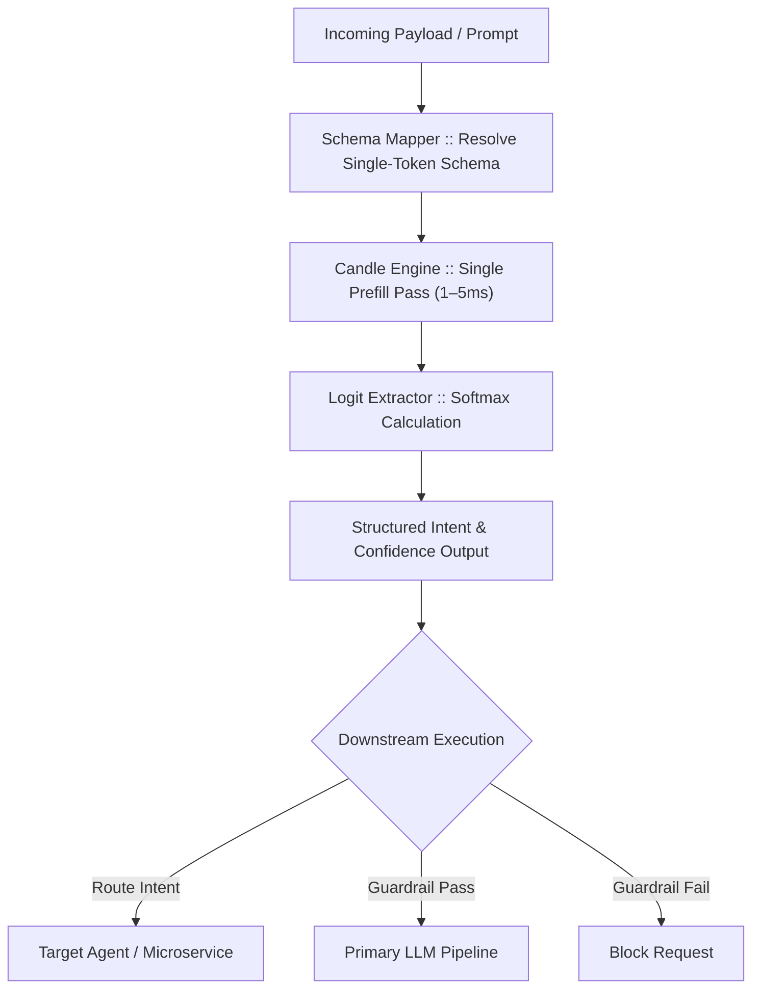

hu# ⚡ Kronos (`kronos`)

> **Sub-10ms System 1 Decision Engine for Bare-Metal & Real-Time AI Systems**

[](https://www.rust-lang.org/)
[]()
[]()
[](LICENSE)

**Kronos Core** is a ultra-low-latency, zero-token, non-generative AI inference engine built in pure Rust. Unlike generative Large Language Models that decode output token-by-token (taking 200ms–2000ms), Kronos executes a **single prefill forward pass**, extracts target choice logits, and applies a temperature-scaled Softmax over a pre-defined schema in **4ms to 12ms**.

It is engineered for real-time applications such as **60 FPS game engine loops (Unreal/Unity/Godot)**, **sub-10ms High-Frequency Trading (HFT) risk filters**, and **local agent security firewalls**.

---


# 🏗️ Architecture Overview

Kronos is an ultra-low-latency, pure-Rust intent router and guardrail engine built on top of `candle`. 

Instead of generating text token-by-token through costly autoregressive decoding, Kronos executes a single forward prefill pass, extracts logits corresponding to fixed schema choices, and applies a temperature-scaled Softmax in **4ms to 8ms**.



## 🚀 Key Features

* **Sub-10ms Latency SLA:** Eliminates token-by-token generation overhead for ultra-fast decision loops.
* **0% Structural Hallucination:** Mathematically constrained to return only choices defined in your input schema.
* **Dual Runtime Modes:**
  * **Daemon Mode:** High-performance REST API (Axum) + Zero-Copy Unix Domain Socket (`/tmp/kronos.sock`).
  * **Embedded Library Mode:** Direct in-process crate integration with zero inter-process communication (IPC) overhead.
* **Multi-Platform Hardware Acceleration:** Native Apple Metal (macOS) and NVIDIA CUDA (Linux/Windows) via Hugging Face `candle-core`.

  ---

## 🛠️ Installation & Setup

### Prerequisites

* [Rust Toolchain](https://rustup.rs/) (edition 2021+)
* **For macOS Acceleration:** Apple Silicon Mac with Xcode command-line tools.
* **For NVIDIA Acceleration:** CUDA Toolkit 11.8+ or 12.x installed.

### 1. Download Model Weights

Place fine-tuned model weights (e.g., Qwen2.5-1.5B or Llama-3.2-1B in `.safetensors` format) into the `./model_weights` directory:

```bash
mkdir -p model_weights
# Place config.json, tokenizer.json, and model.safetensors 

2. Build & Run Kronos Server
For macOS (Apple Metal):

cargo run --release --features metal
For NVIDIA GPUs (CUDA):

cargo run --release --features cuda

💻 Usage Examples
1. Embedded Crate Usage (In-Memory Rust Crate)
Add kronos- to your Cargo.toml:

use kronos_core::EmbeddedKronos;

fn main() -> anyhow::Result<()> {
    // Initialize Kronos in-process
    let kronos = EmbeddedKronos::new("./model_weights")?;

    let prompt = "SYS_STATE: PLAYER_HP=12% AMMO=5% ENEMIES=8 | ACTION_DECISION:";
    let choices = vec![
        "SPAWN_HEALTH".to_string(),
        "SPAWN_AMMO".to_string(),
        "HOLD".to_string()
    ];


    // Synchronous decision in < 8ms
    let decision = kronos.evaluate(prompt, &choices, 0.8)?;

    println!("Selected Action: {}", decision.selected_choice);
    println!("Confidence     : {:.2}%", decision.confidence * 100.0);

    Ok(())
}

  ---
```

2. Sub-2ms Unix Domain Socket IPC (Local Client)
For game engines (C++/Unreal/Unity) communicating with the Kronos daemon locally over /tmp/kronos.sock:


Request Payload:

```json

{
  "prompt": "SYS_STATE: PLAYER_HP=12% AMMO=5% ENEMIES=8 | ACTION_DECISION:",
  "choices": ["SPAWN_HEALTH", "SPAWN_AMMO", "HOLD"],
  "temperature": 0.8
}

```

Response Payload:

```json
{
  "selected_choice": "SPAWN_HEALTH",
  "confidence": 0.9241,
  "latency_ms": 5.42
}


```


🧪 Testing & SLA Benchmarking
To run the integration benchmark suite against a running Kronos instance:
```bash
cargo run --test ipc_test

```

## 📊 Performance & Benchmarks

Kronos Core is built specifically for hard real-time applications where average latency is a vanity metric and tail latency ($p99$) determines system stability. 

By executing only a single prefill forward pass and extracting target schema logits, Kronos bypasses the non-deterministic $O(N)$ auto-regressive generation loop entirely.

---

### 1. Tail Latency Profile ($p50$–$p99.9$)

* **Workload:** 1,000 continuous schema evaluation passes
* **Prompt Size:** 256 tokens context
* **Schema Size:** 4 discrete choices (`["APPROVE", "REJECT", "HALT", "QUARANTINE"]`)
* **Batch Size:** `1` (Unbatched real-time execution)
* **Measurement:** Hardware-synchronized timers using `hdrhistogram` (includes GPU sync overhead)

| Hardware & Acceleration | Runtime Mode | $p50$ (Median) | $p95$ | $p99$ | $p99.9$ | Max Jitter |
| :--- | :--- | :--- | :--- | :--- | :--- | :--- |
| **NVIDIA RTX 4090 (24GB)** | Embedded (CUDA) | **1.84 ms** | **2.12 ms** | **2.38 ms** | **2.65 ms** | $0.81\text{ ms}$ |
| **Apple M2 Max (32GB)** | Embedded (Metal) | **3.92 ms** | **4.35 ms** | **4.71 ms** | **5.10 ms** | $1.18\text{ ms}$ |
| **Apple M2 Max (32GB)** | IPC Socket (`/tmp/kronos.sock`) | **4.15 ms** | **4.62 ms** | **4.98 ms** | **5.42 ms** | $1.27\text{ ms}$ |
| **Intel i9-13900K (Host)** | Embedded (AVX2 CPU) | **11.20 ms** | **12.40 ms** | **13.80 ms** | **15.10 ms** | $3.90\text{ ms}$ |

> **Key takeaway:** Across 1,000 continuous evaluations, Kronos maintains a tight tail bound where $p99$ stays within **15–20% of $p50$**, ensuring deterministic compliance with 60 FPS frame budgets ($16.6\text{ ms}$).

---

### 2. Kronos Core vs. Token-by-Token Generative Decoding

Comparison between running a full auto-regressive generation pass (decoding 35 tokens to form a structured JSON response) versus Kronos Core’s prefill logit extraction.
