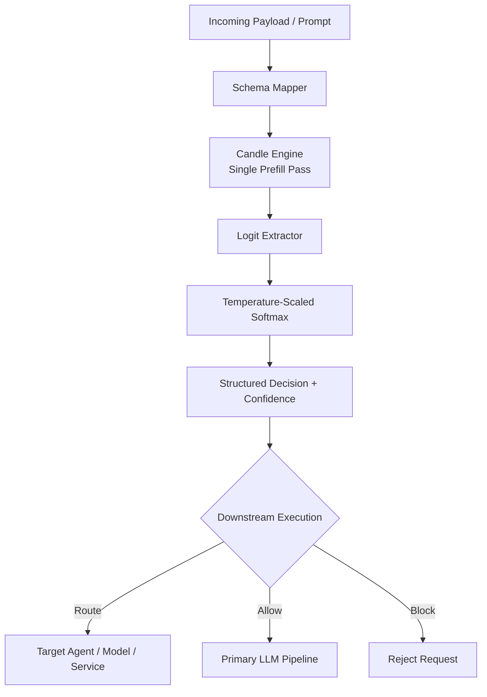

# ⚡ Kronos

**Kronos** is an ultra-low-latency, zero-generation **System 1 decision engine** built in pure Rust and powered by [Hugging Face Candle](https://github.com/huggingface/candle).

Instead of generating an answer token-by-token, Kronos performs a **single prefill forward pass**, extracts logits for a predefined set of schema choices, and converts them into confidence scores.

The result is a compact decision primitive for **AI routing, guardrails, agent gating, and real-time AI systems**.

> **Kronos — The Sub-10ms Decision Engine for Real-Time AI**

---

## 🚀 Why Kronos?

Modern AI applications often spend significantly more time and compute generating responses than they need to make simple decisions.

Before invoking an expensive LLM or agent, many systems only need to answer questions such as:

* Which model should handle this request?
* Should this request be allowed?
* Which agent should receive it?
* Is this request high-risk?
* Should expensive inference be skipped?
* Which execution path should be selected?

Kronos is designed to make these decisions locally with minimal latency.

```text
Incoming Request
       │
       ▼
┌──────────────────────┐
│       KRONOS         │
│                      │
│  Local inference     │
│  Schema-constrained  │
│  Zero generation     │
│  Low latency         │
└──────────┬───────────┘
           │
      Decision
           │
    ┌──────┼──────┐
    ▼      ▼      ▼
  Route   Allow  Block
    │      │      │
    ▼      ▼      ▼
 Agent    LLM   Reject
```

---

## ⚡ Core Idea

Traditional LLM inference generally uses autoregressive generation:

```text
Prompt
  │
  ▼
Prefill
  │
  ▼
Token → Token → Token → Token
  │
  ▼
Final response
```

Kronos uses a different execution path:

```text
Prompt
  │
  ▼
Single Prefill Forward Pass
  │
  ▼
Relevant Choice Logits
  │
  ▼
Temperature-Scaled Softmax
  │
  ▼
Structured Decision
```

There is **no autoregressive decoding loop** and no generated text that needs to be parsed back into a decision.

---

## 🧠 How It Works

Given a schema:

```text
["APPROVE", "REJECT", "HALT"]
```

Kronos resolves the corresponding vocabulary token IDs and performs a single model forward pass.

Conceptually:

```text
Prompt
   │
   ▼
Tokenizer
   │
   ▼
Candle Model
   │
   │  Single Forward Pass
   ▼
Logits
   │
   ├── APPROVE → 4.82
   ├── REJECT  → 1.27
   └── HALT    → 0.63
            │
            ▼
     Temperature Scaling
            │
            ▼
       Probability
            │
            ▼
    Structured Decision
```

The output is restricted to the predefined schema.

This provides **zero invalid-choice generation** at the output layer. It does not imply that the model's semantic decision is always correct.

---

## ✨ Key Features

### ⚡ Zero-Generation Decision Engine

* Single prefill forward pass
* No autoregressive token generation
* No generated-text parsing
* Direct logit extraction
* Temperature-scaled probability calculation
* Designed for low-latency local decisions

### 🎯 Schema-Constrained Decisions

Define the choices your application accepts:

```rust
let schema = Schema::choices(&[
    "APPROVE",
    "REJECT",
    "HALT",
]);
```

Kronos evaluates the model against those choices rather than asking it to generate arbitrary text.

### 🦀 Pure Rust

Built around the Rust ecosystem and [Candle](https://github.com/huggingface/candle).

Designed for:

* Embedded inference
* Low-latency services
* Edge systems
* On-premise deployments
* Local AI infrastructure

### 🧩 Multi-Architecture Model Support

Kronos is designed to support multiple open-weight model architectures through dynamic model configuration.

Current architecture targets include:

* Qwen2
* Llama 3
* Mistral

Model support depends on the corresponding Candle implementation and Kronos integration.

### 💾 Multi-Shard Safetensors

Kronos can discover and load single or multi-shard `.safetensors` model weights using Candle's memory-mapped weight loading.

### 🖥️ Hardware Acceleration

Designed to dispatch inference across supported hardware backends:

* CUDA
* Metal
* CPU fallback

Precision and backend availability depend on the selected model and hardware.

### 🌐 Multiple Interfaces

Kronos provides several integration paths.

#### Embedded Rust API

Use Kronos directly inside a Rust application:

```rust
let engine = KronosEngine::init()?;

let schema = Schema::choices(&[
    "APPROVE",
    "REJECT",
    "HALT",
]);

let decision = engine.evaluate(
    "Market volatility: high. Order size: 50,000 USD.",
    &schema,
)?;
```

This avoids network overhead and is intended for latency-sensitive applications.

#### REST API

An Axum-based HTTP interface provides endpoints such as:

```text
POST /v1/decision
GET  /health
```

#### Unix Domain Socket

For local sidecar deployments, Kronos provides a Unix Domain Socket interface using newline-delimited JSON framing.

This can be useful when the caller and Kronos run on the same machine but are implemented in different languages.

---

# 🏗️ Architecture



---

# 🔥 Where Kronos Fits

Kronos is not intended to replace a full AI gateway.

A gateway may handle:

* Provider integrations
* API keys
* Retries
* Load balancing
* Observability
* Budgets
* Authentication
* Request management

Kronos focuses on the **decision layer underneath or beside those systems**.

```text
                AI APPLICATION
                      │
                      ▼
              ┌───────────────┐
              │    KRONOS     │
              │               │
              │ 1–5ms target  │
              │ Local decision│
              └───────┬───────┘
                      │
              ┌───────┼────────┐
              ▼       ▼        ▼
            Route    Allow    Block
              │       │
              ▼       ▼
        AI Gateway / Application
              │
       ┌──────┼─────────┐
       ▼      ▼         ▼
      LLM   Agent      Tools
```

This makes Kronos suitable as a **decision primitive** inside larger AI infrastructure.

---

# 🎯 Use Cases

## Model Routing

Select an appropriate model before invoking expensive inference.

```text
Request
   │
   ▼
 Kronos
   │
   ├── SIMPLE ──────► Small Model
   │
   ├── COMPLEX ─────► Large Model
   │
   └── CODE ────────► Coding Model
```

---

## Agent Gating

Determine whether an agent should execute.

```text
User Request
     │
     ▼
   Kronos
     │
 ┌───┴────┐
 ▼        ▼
ALLOW    BLOCK
 │
 ▼
Agent
```

---

## AI Guardrails

Run an inexpensive local decision before expensive generation.

```text
Request
   │
   ▼
Kronos Guardrail
   │
   ├── SAFE ──────► LLM
   │
   └── UNSAFE ────► Block
```

---

## Model Cascading

Use a small decision model to determine whether a larger model is necessary.

```text
Request
   │
   ▼
 Kronos
   │
   ├── Easy ───► Small Model
   │
   └── Hard ───► Large Model
```

The potential value is not simply lower decision latency.

The larger objective is to **avoid unnecessary expensive inference**.

---

## Edge & On-Premise AI

Kronos can operate locally without requiring every decision to be sent to a remote inference service.

Potential environments include:

* Edge servers
* Private infrastructure
* Industrial systems
* Embedded AI
* On-premise AI platforms
* Local agent runtimes

---

# 📊 Latency

Kronos is designed for **sub-10ms local decision inference**, with current development targeting approximately **1–5ms warm inference** under suitable hardware and workload conditions.

Actual latency depends on:

* Model architecture
* Model size
* Input length
* Hardware
* Backend
* Memory bandwidth
* Schema size
* Runtime configuration
* Synchronization behavior

Always benchmark Kronos on your target hardware before making latency guarantees.

### Recommended Benchmark Metrics

Kronos benchmarks should report:

```text
p50
p95
p99
p99.9
max
```

along with:

```text
CPU / GPU
Model
Model precision
Input tokens
Schema size
Operating system
Backend
Cold-start latency
Warm latency
```

---

# 📈 Benchmarking

A basic latency benchmark can be run using:

```rust
use std::time::Instant;
use hdrhistogram::Histogram;
use kronos_core::{KronosEngine, Schema};

fn main() -> Result<(), Box<dyn std::error::Error>> {
    let engine = KronosEngine::init()?;

    let schema = Schema::choices(&[
        "APPROVE",
        "REJECT",
        "HALT",
    ]);

    let prompt =
        "Market volatility: high. Order size: 50,000 USD.";

    // Warmup
    let _ = engine.evaluate(prompt, &schema)?;

    let iterations = 10_000;

    let mut histogram =
        Histogram::<u64>::new_with_bounds(
            1,
            1_000_000,
            3,
        )?;

    for _ in 0..iterations {
        let start = Instant::now();

        let _decision =
            engine.evaluate(prompt, &schema)?;

        let duration =
            start.elapsed().as_micros() as u64;

        histogram.record(duration)?;
    }

    println!("=== Kronos Latency Profile ===");

    println!(
        "p50:   {} µs ({:.2} ms)",
        histogram.value_at_quantile(0.50),
        histogram.value_at_quantile(0.50) as f64 / 1000.0
    );

    println!(
        "p95:   {} µs ({:.2} ms)",
        histogram.value_at_quantile(0.95),
        histogram.value_at_quantile(0.95) as f64 / 1000.0
    );

    println!(
        "p99:   {} µs ({:.2} ms)",
        histogram.value_at_quantile(0.99),
        histogram.value_at_quantile(0.99) as f64 / 1000.0
    );

    println!(
        "Max:   {} µs ({:.2} ms)",
        histogram.max(),
        histogram.max() as f64 / 1000.0
    );

    Ok(())
}
```

For production benchmarking, measure the complete path separately:

```text
Tokenization
     │
     ▼
Schema Resolution
     │
     ▼
Candle Forward Pass
     │
     ▼
GPU Synchronization
     │
     ▼
Logit Extraction
     │
     ▼
Softmax
     │
     ▼
Decision Construction
```

---

# 🧪 Accuracy Matters

Latency alone does not determine whether a routing or guardrail engine is useful.

A meaningful Kronos evaluation should measure both:

```text
Decision Quality
+
Decision Latency
```

Recommended metrics include:

* Accuracy
* Macro F1
* Precision / Recall
* Confusion matrix
* Calibration
* p50 latency
* p95 latency
* p99 latency
* p99.9 latency
* Memory usage
* GPU utilization

Most importantly, evaluate whether Kronos can **reduce expensive downstream inference while maintaining acceptable decision quality**.

---

# 🔬 Design Philosophy

Kronos follows a simple principle:

> **Don't generate when you only need to decide.**

Many AI workflows do not require a paragraph of generated text.

They require:

```text
ALLOW
BLOCK
ROUTE_A
ROUTE_B
ESCALATE
SAFE
UNSAFE
SIMPLE
COMPLEX
```

When the output space is known in advance, generation can be replaced with constrained decision inference.

---

# 🛠️ Project Structure

A typical Kronos deployment can expose three layers:

```text
┌───────────────────────────────────────┐
│             Application               │
└───────────────────┬───────────────────┘
                    │
          ┌─────────┴─────────┐
          │                   │
          ▼                   ▼
    Embedded API          REST / UDS
          │                   │
          └─────────┬─────────┘
                    ▼
             Kronos Engine
                    │
                    ▼
              Candle Runtime
                    │
             ┌──────┴──────┐
             ▼             ▼
           CPU          GPU Backend
```

---

# 💻 Quick Start

## 1. Requirements

* Rust 1.75+
* Local Hugging Face model directory
* `config.json`
* `tokenizer.json`
* `.safetensors` model weights
* Supported CPU, CUDA, or Metal environment

> The actual minimum Rust version depends on the current dependency set and should be verified against the project's `Cargo.lock` and CI configuration.

---

## 2. Initialize the Engine

```rust
use kronos_core::KronosEngine;

let engine = KronosEngine::init()?;
```

---

## 3. Define a Decision Schema

```rust
use kronos_core::Schema;

let schema = Schema::choices(&[
    "APPROVE",
    "REJECT",
    "HALT",
]);
```

---

## 4. Evaluate

```rust
let result = engine.evaluate(
    "Market volatility: high. Order size: 50,000 USD.",
    &schema,
)?;

println!("{:?}", result);
```

---

# 🌐 API Example

A REST request can conceptually look like:

```http
POST /v1/decision
Content-Type: application/json
```

```json
{
  "prompt": "Market volatility: high. Order size: 50,000 USD.",
  "choices": [
    "APPROVE",
    "REJECT",
    "HALT"
  ]
}
```

Example structured response:

```json
{
  "decision": "HALT",
  "confidence": 0.91
}
```

The exact response schema is subject to the current Kronos API implementation.

---

# 🔒 Reliability

Kronos is designed around explicit failure handling rather than generated-text parsing.

The runtime provides:

* Structured error propagation
* Health endpoint
* Graceful shutdown
* Unix socket cleanup
* Async HTTP handling
* Dedicated blocking workers for tensor operations
* Microsecond-level latency measurement

Production deployments should still validate:

* OOM behavior
* GPU failures
* Model loading failures
* Invalid schemas
* Invalid model files
* Concurrent requests
* Process restarts
* Resource exhaustion

---

# 🧭 Roadmap

Potential future development areas include:

* [ ] More model architectures
* [ ] CUDA optimization
* [ ] Metal optimization
* [ ] CPU SIMD optimization
* [ ] Dynamic batching
* [ ] Streaming decision APIs
* [ ] More comprehensive benchmark suite
* [ ] Accuracy evaluation datasets
* [ ] Model routing benchmarks
* [ ] Guardrail benchmarks
* [ ] OpenTelemetry integration
* [ ] C-compatible FFI
* [ ] Python bindings
* [ ] WASM / edge targets
* [ ] Quantized model support
* [ ] Production deployment examples

---

# 🤝 Contributing

Contributions are welcome.

Areas that are particularly useful:

* New Candle model architectures
* Hardware backend optimization
* Benchmarking
* Accuracy datasets
* Routing strategies
* Guardrail evaluation
* API integrations
* Documentation
* Performance profiling

---

# 📜 License

See the repository license for current licensing terms.

---

# ⚡ The Kronos Thesis

Large language models are expensive and powerful.

But not every AI decision requires generation.

Kronos explores a simpler execution model:

```text
        EXPENSIVE AI
             ▲
             │
      Only when needed
             │
             │
       ┌───────────┐
       │   KRONOS  │
       │           │
       │  Decide   │
       │  Route    │
       │  Gate     │
       │  Filter   │
       └─────┬─────┘
             │
             ▼
        AI SYSTEM
```

**Make the decision first.
Generate only when necessary.**
