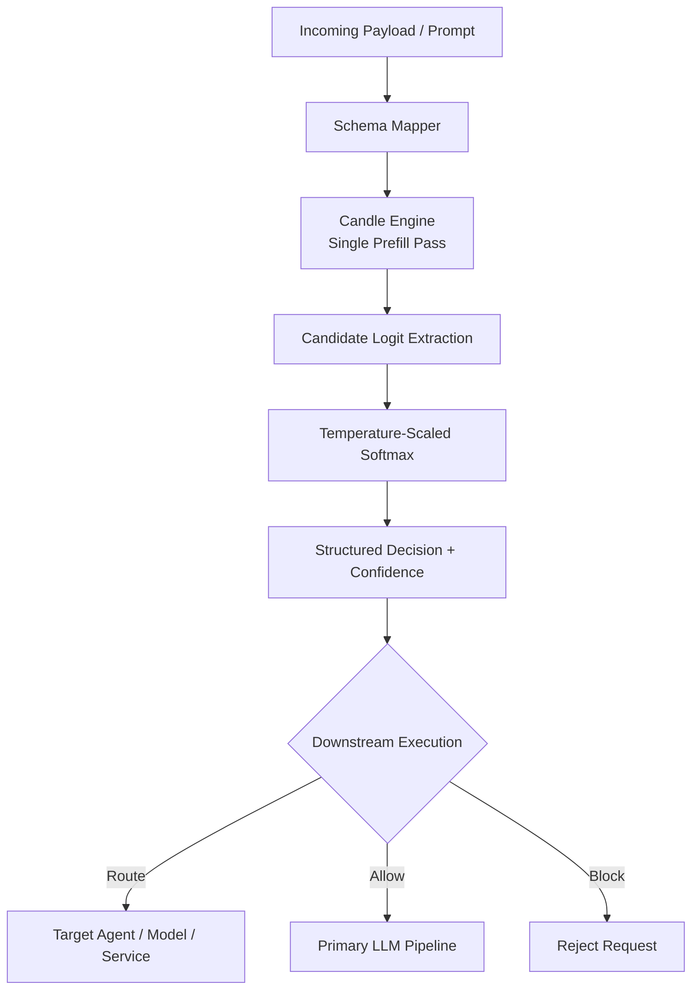

# ⚡ Kronos

**Kronos** is an ultra-low-latency, zero-generation **System 1 decision runtime** built in pure Rust and powered by [Hugging Face Candle](https://github.com/huggingface/candle).

Instead of generating an answer token-by-token, Kronos performs a **single prefill forward pass**, extracts logits for a predefined decision schema, and converts those logits into confidence scores.

The result is a local decision primitive for **AI routing, guardrails, agent gating, tool selection, and real-time AI systems**.

> **Kronos — The Decision Runtime for Real-Time AI**

---

## 🚀 Why Kronos?

Modern AI systems frequently invoke expensive models for decisions that do not require a generated response.

Before executing an LLM, agent, or tool, an application may only need to determine:

* Which model should handle this request?
* Should this request be allowed?
* Which agent should receive it?
* Which tool should be selected?
* Is the request safe?
* Should expensive inference be skipped?
* Which execution path should be selected?

Kronos is designed to make these decisions locally with minimal inference overhead.

```text
Incoming Request
       │
       ▼
┌──────────────────────┐
│       KRONOS         │
│                      │
│  Local inference     │
│  Schema-constrained  │
│  Zero generation     │
│  Low latency         │
└──────────┬───────────┘
           │
        Decision
           │
    ┌──────┼──────┐
    ▼      ▼      ▼
  Route   Allow  Block
    │      │      │
    ▼      ▼      ▼
 Agent    LLM   Reject
```

---

# 🧠 Core Idea

Traditional LLM inference generally relies on autoregressive generation:

```text
Prompt
  │
  ▼
Prefill
  │
  ▼
Token → Token → Token → Token
  │
  ▼
Generated response
```

Kronos uses a different execution path:

```text
Prompt
  │
  ▼
Single Prefill Forward Pass
  │
  ▼
Relevant Choice Logits
  │
  ▼
Temperature-Scaled Softmax
  │
  ▼
Structured Decision
```

There is no autoregressive decoding loop and no generated text that needs to be parsed back into a decision.

---

# 🎯 Schema-Constrained Decisions

Kronos evaluates a predefined set of candidate choices.

For example:

```rust
let schema = Schema::choices(&[
    "APPROVE",
    "REJECT",
    "HALT",
]);
```

Conceptually, the model produces logits such as:

```text
APPROVE  →  4.82
REJECT   →  1.27
HALT     →  0.63
```

Kronos extracts the relevant logits and applies temperature-scaled Softmax:

```text
APPROVE  →  0.94
REJECT   →  0.04
HALT     →  0.02
```

The resulting decision is selected from the predefined schema.

### What this guarantees

At the output layer, Kronos can guarantee that the selected decision is one of the allowed schema choices.

In other words:

> **Zero invalid-choice outputs.**

### What this does not guarantee

Schema constraints do **not** guarantee semantic correctness.

If the underlying model incorrectly interprets the input, Kronos can still produce an incorrect decision with a high confidence score.

For example:

```text
Correct semantic judgment:
SAFE

Model judgment:
UNSAFE

Kronos:
UNSAFE → 0.91
```

The output is structurally valid, but the underlying model judgment can still be wrong.

Therefore, **schema compliance and semantic accuracy are separate properties**.

---

# ⚠️ Schema & Tokenizer Considerations

Kronos's lowest-latency decision path is optimized for choices that can be resolved directly to vocabulary token IDs.

For example:

```text
APPROVE
REJECT
HALT
SAFE
UNSAFE
```

This works particularly well when each candidate maps cleanly to the expected token representation.

However, natural language choices are not always represented by a single token.

For example:

```text
"approve transaction"
"send to security agent"
"requires human review"
```

may be represented by multiple sub-word tokens depending on the model tokenizer.

In these cases, direct single-token logit extraction is insufficient by itself.

Supporting multi-token choices may require additional techniques such as:

* Token alignment
* Candidate scoring across multiple tokens
* Prompt framing
* Constrained decoding
* Sequence-level probability calculations

These approaches may have different latency characteristics from the core single-token path.

Therefore, the strongest Kronos performance claims apply to **schema choices that can be resolved efficiently by the selected model/tokenizer**.

---

# ✨ Key Features

## ⚡ Zero-Generation Decision Engine

* Single prefill forward pass
* No autoregressive decoding loop
* No generated-text parsing
* Direct candidate-logit extraction
* Temperature-scaled probability calculation
* Structured decision output

## 🎯 Deterministic Output Space

The application defines the valid decision space before inference.

```text
Schema
  │
  ├── APPROVE
  ├── REJECT
  └── HALT
```

Kronos selects from that predefined space rather than allowing arbitrary generated text.

This provides **structural output constraints**, not guaranteed semantic correctness.

## 🦀 Pure Rust Runtime

Kronos is implemented in Rust and built around [Candle](https://github.com/huggingface/candle).

The runtime is designed for:

* Embedded inference
* Low-latency services
* Edge systems
* On-premise deployments
* Local AI infrastructure

## 🧩 Multi-Architecture Model Support

Kronos is designed to support multiple open-weight model architectures through dynamic model configuration.

Current architecture targets include:

* Qwen2
* Llama 3
* Mistral

Model support depends on the corresponding Candle implementation and Kronos integration.

## 💾 Safetensors Support

Kronos can load single or multi-shard `.safetensors` model weights using Candle's memory-mapped weight loading.

## 🖥️ Hardware Acceleration

Kronos is designed to use supported Candle hardware backends:

* CUDA
* Metal
* CPU

Actual precision and backend support depend on the selected model, device, and runtime configuration.

## 🌐 Multiple Interfaces

### Embedded Rust API

Kronos can run directly inside a Rust application:

```rust
let decision = engine.evaluate(
    prompt,
    &schema,
)?;
```

This avoids network overhead and is intended for latency-sensitive applications.

### REST API

An Axum-based HTTP interface provides endpoints such as:

```text
POST /v1/decision
GET  /health
```

### Unix Domain Socket

For local sidecar deployments, Kronos provides a Unix Domain Socket interface using newline-delimited JSON framing.

This allows applications written in other languages to communicate with a local Kronos process without requiring a remote service.

---

# 🏗️ Architecture



---

# 🔥 Where Kronos Fits

Kronos is intentionally **not a full AI gateway**.

A gateway typically handles concerns such as:

* Provider integrations
* API keys
* Provider failover
* Rate limiting
* Load balancing
* Authentication
* Budgets
* Billing
* Observability
* Request management

Kronos focuses on a narrower problem:

> **Making a local semantic decision before expensive AI execution.**

It can therefore operate underneath or alongside an AI gateway.

```text
                AI APPLICATION
                      │
                      ▼
              ┌───────────────┐
              │    KRONOS     │
              │               │
              │ Local decision│
              │ Runtime       │
              └───────┬───────┘
                      │
              ┌───────┼────────┐
              ▼       ▼        ▼
            Route    Allow    Block
              │       │
              ▼       ▼
        AI Gateway / Application
              │
       ┌──────┼─────────┐
       ▼      ▼         ▼
      LLM   Agent      Tools
```

Kronos can therefore complement systems such as LLM gateways rather than attempting to replace their infrastructure responsibilities.

---

# 🚫 What Kronos Is Not

## Not an AI Gateway

Kronos does not attempt to provide:

* Provider API-key management
* Provider failover
* Billing
* Rate-limit management
* Multi-provider load balancing
* Model marketplaces
* Gateway-level observability

Those are gateway/control-plane responsibilities.

## Not a General-Purpose Text Generator

Kronos is designed to make constrained decisions.

It is not intended to replace a general-purpose LLM for:

* Long-form generation
* Open-ended conversations
* Complex reasoning
* Code generation
* Document generation
* Creative writing

The expected output is a structured decision such as:

```text
ALLOW
BLOCK
ROUTE_A
ROUTE_B
SAFE
UNSAFE
SIMPLE
COMPLEX
```

---

# 🎯 Use Cases

## Model Routing

Select an appropriate model before invoking expensive inference.

```text
Request
   │
   ▼
 Kronos
   │
   ├── SIMPLE ──────► Small Model
   │
   ├── COMPLEX ─────► Large Model
   │
   └── CODE ────────► Coding Model
```

---

## Agent Gating

Determine whether an agent should execute.

```text
User Request
     │
     ▼
   Kronos
     │
 ┌───┴────┐
 ▼        ▼
ALLOW    BLOCK
 │
 ▼
Agent
```

---

## AI Guardrails

Run a local decision before expensive generation.

```text
Request
   │
   ▼
Kronos Guardrail
   │
   ├── SAFE ──────► LLM
   │
   └── UNSAFE ───► Block
```

---

## Tool Selection

Determine which tool or execution path should handle a request.

```text
Request
   │
   ▼
 Kronos
   │
   ├── DATABASE
   ├── WEB
   ├── CALCULATOR
   └── NO_TOOL
```

---

## Model Cascading

Determine whether a larger model is necessary.

```text
Request
   │
   ▼
 Kronos
   │
   ├── Easy ───► Small Model
   │
   └── Hard ───► Large Model
```

The potential value is not simply lower decision latency.

The larger objective is to **avoid unnecessary expensive inference**.

---

# 📊 Latency

Kronos is designed for low-latency local decision inference, with a current development target of approximately **1–5 ms warm inference** under suitable workloads and hardware.

This should be treated as a **benchmark target**, not a universal guarantee.

Actual latency depends on:

* Model architecture
* Model size
* Input length
* Tokenizer
* Hardware
* Backend
* Memory bandwidth
* Schema size
* Runtime configuration
* GPU synchronization
* Concurrency

Meaningful latency reporting should include:

```text
p50
p95
p99
p99.9
max
```

along with the hardware and workload used to produce the measurements.

---

# 📈 Benchmarking

A basic latency benchmark can be run using:

```rust
use std::time::Instant;
use hdrhistogram::Histogram;
use kronos_core::{KronosEngine, Schema};

fn main() -> Result<(), Box<dyn std::error::Error>> {
    let engine = KronosEngine::init()?;

    let schema = Schema::choices(&[
        "APPROVE",
        "REJECT",
        "HALT",
    ]);

    let prompt =
        "Market volatility: high. Order size: 50,000 USD.";

    // Warmup
    let _ = engine.evaluate(prompt, &schema)?;

    let iterations = 10_000;

    let mut histogram =
        Histogram::<u64>::new_with_bounds(
            1,
            1_000_000,
            3,
        )?;

    for _ in 0..iterations {
        let start = Instant::now();

        let _decision =
            engine.evaluate(prompt, &schema)?;

        let duration =
            start.elapsed().as_micros() as u64;

        histogram.record(duration)?;
    }

    println!("=== Kronos Latency Profile ===");

    println!(
        "p50:   {} µs ({:.2} ms)",
        histogram.value_at_quantile(0.50),
        histogram.value_at_quantile(0.50) as f64 / 1000.0
    );

    println!(
        "p95:   {} µs ({:.2} ms)",
        histogram.value_at_quantile(0.95),
        histogram.value_at_quantile(0.95) as f64 / 1000.0
    );

    println!(
        "p99:   {} µs ({:.2} ms)",
        histogram.value_at_quantile(0.99),
        histogram.value_at_quantile(0.99) as f64 / 1000.0
    );

    println!(
        "Max:   {} µs ({:.2} ms)",
        histogram.max(),
        histogram.max() as f64 / 1000.0
    );

    Ok(())
}
```

For production benchmarking, measure the pipeline separately:

```text
Tokenization
     │
     ▼
Schema Resolution
     │
     ▼
Candle Forward Pass
     │
     ▼
GPU Synchronization
     │
     ▼
Logit Extraction
     │
     ▼
Softmax
     │
     ▼
Decision Construction
```

---

# 🧪 Accuracy Matters

Latency alone does not establish whether a decision engine is useful.

A meaningful Kronos evaluation should measure:

```text
Decision Quality
+
Decision Latency
+
Resource Cost
```

Recommended metrics include:

* Accuracy
* Macro F1
* Precision / Recall
* Confusion matrix
* Calibration
* p50 latency
* p95 latency
* p99 latency
* p99.9 latency
* Memory usage
* GPU utilization

The key product question is:

> **Can Kronos make sufficiently accurate semantic decisions at substantially lower latency and cost than invoking a larger downstream model?**

---

# 🔬 Design Philosophy

Kronos follows a simple principle:

> **Don't generate when you only need to decide.**

Many AI workflows do not require a paragraph of generated text.

They require:

```text
ALLOW
BLOCK
ROUTE_A
ROUTE_B
ESCALATE
SAFE
UNSAFE
SIMPLE
COMPLEX
```

When the output space is known in advance, generation can be replaced with constrained decision inference.

---

# 🛠️ Project Structure

A typical Kronos deployment can expose three layers:

```text
┌───────────────────────────────────────┐
│             Application               │
└───────────────────┬───────────────────┘
                    │
          ┌─────────┴─────────┐
          │                   │
          ▼                   ▼
    Embedded API          REST / UDS
          │                   │
          └─────────┬─────────┘
                    ▼
             Kronos Engine
                    │
                    ▼
              Candle Runtime
                    │
             ┌──────┴──────┐
             ▼             ▼
           CPU          GPU Backend
```

---

# 💻 Quick Start

## Requirements

* Rust 1.75+
* Local Hugging Face model directory
* `config.json`
* `tokenizer.json`
* `.safetensors` model weights
* Supported CPU, CUDA, or Metal environment

> The actual minimum Rust version depends on the current dependency set and should be verified against the project's `Cargo.lock` and CI configuration.

---

## Initialize the Engine

```rust
use kronos_core::KronosEngine;

let engine = KronosEngine::init()?;
```

---

## Define a Decision Schema

```rust
use kronos_core::Schema;

let schema = Schema::choices(&[
    "APPROVE",
    "REJECT",
    "HALT",
]);
```

---

## Evaluate

```rust
let result = engine.evaluate(
    "Market volatility: high. Order size: 50,000 USD.",
    &schema,
)?;

println!("{:?}", result);
```

---

# 🌐 API Example

A REST request can conceptually look like:

```http
POST /v1/decision
Content-Type: application/json
```

```json
{
  "prompt": "Market volatility: high. Order size: 50,000 USD.",
  "choices": [
    "APPROVE",
    "REJECT",
    "HALT"
  ]
}
```

Example structured response:

```json
{
  "decision": "HALT",
  "confidence": 0.91
}
```

The exact response schema is subject to the current Kronos API implementation.

---

# 🔒 Reliability

Kronos is designed around explicit failure handling rather than generated-text parsing.

The runtime provides:

* Structured error propagation
* Health endpoint
* Graceful shutdown
* Unix socket cleanup
* Async HTTP handling
* Dedicated blocking workers for tensor operations
* Microsecond-level latency measurement

Production deployments should still validate:

* OOM behavior
* GPU failures
* Model loading failures
* Invalid schemas
* Invalid model files
* Concurrent requests
* Process restarts
* Resource exhaustion

---

# 🧭 Roadmap

* [ ] More model architectures
* [ ] CUDA optimization
* [ ] Metal optimization
* [ ] CPU SIMD optimization
* [ ] Dynamic batching
* [ ] Multi-token candidate scoring
* [ ] Streaming decision APIs
* [ ] Comprehensive benchmark suite
* [ ] Accuracy evaluation datasets
* [ ] Model routing benchmarks
* [ ] Guardrail benchmarks
* [ ] OpenTelemetry integration
* [ ] C-compatible FFI
* [ ] Python bindings
* [ ] WASM / edge targets
* [ ] Quantized model support
* [ ] Production deployment examples

---

# 🤝 Contributing

Contributions are welcome.

Areas that are particularly useful:

* New Candle model architectures
* Hardware backend optimization
* Benchmarking
* Accuracy datasets
* Routing strategies
* Guardrail evaluation
* API integrations
* Documentation
* Performance profiling

---

# 📜 License

See the repository license for current licensing terms.

---

# ⚡ The Kronos Thesis

Large language models are powerful, but many AI workflows do not require generation for every step.

Sometimes the application only needs to decide:

```text
Should I call the model?
Which model should I call?
Which agent should execute?
Which tool should run?
Should this request be blocked?
```

Kronos provides a local execution layer for those decisions.

```text
             EXPENSIVE AI
                  ▲
                  │
           Only when needed
                  │
           ┌─────────────┐
           │   KRONOS    │
           │             │
           │   Decide    │
           │   Route     │
           │   Gate      │
           │   Filter    │
           └──────┬──────┘
                  │
                  ▼
              AI SYSTEM
```

**Make the decision first.
Generate only when necessary.**
